# ArtificialLife-Environment
UNAL 2018_I - Artificial Life Project

## Description
Artificial environment developed as final project for Artificial life course at Universidad Nacional de Colombia

### Components
#### Living Beings
Modeled agents correspond to fishes.
There are two species coexisting at the environment: preys and predators.

Both of them have features as
 - Speed
 - Metabolism rate
 - Energy level (current): Increased by eating, decreased at metabolism rate
 - Minimum energy level: If the energy level becomes less than this, the agent dies
 - Vision range* (preys only)
 - Skin* (preys only)
 - Shape

Preys tend to need more food, since eating plants increase their energy level by a small value. Predators can become inactive for periods when they reach a food satisfaction threshold, such level is reached when eating approximately 2 fishes.

Note: Preys also have a food satisfaction threshold, when it is reached, *boids* and *escape* behaviors take control; anyway it is a ephemeral state and they'll need to get food soon.

**Agents**

**Preys:**
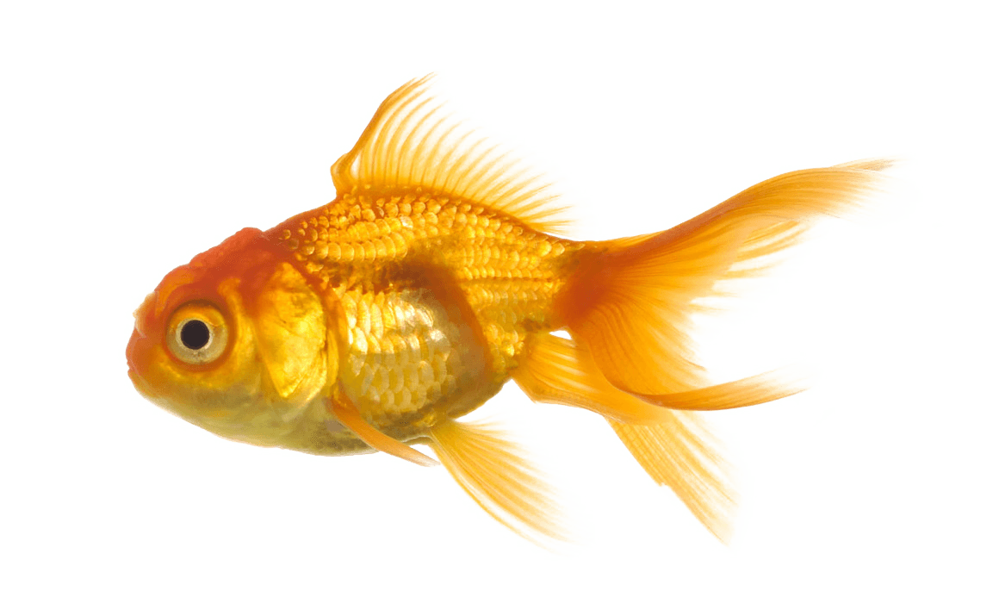

**Predators:**
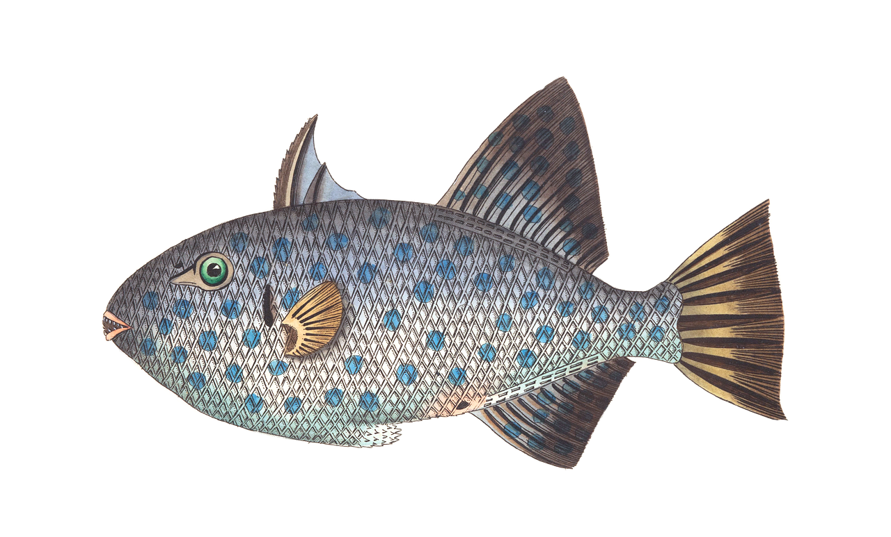

**Behavior**

The agents' behavior is determined by simple rules.

**Preys:**

Several behaviors are mixed, according to certain precedence:
 1. Escape from predators
 2. Seek food
 3. Flock motion (a.k.a *boids*)
  ..1.Cohesion
  ..2.Alignment
  ..3.Separation

**Predators:**

This behavior is a little bit simpler than preys':
 1. Hunt when the current energy level is under food satisfaction level
 2. Be *quiet* (reduced velocity) otherwise

### Shape
 Each agent loads a default image and performs and affine non linear-transformation which tries to mimic *fisheye* distortion

**Examples**:

**Preys:**

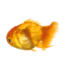

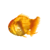
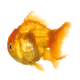

**Predators:**

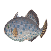
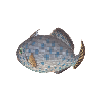
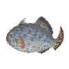
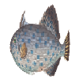

### Skins
Preys have skins which are made using Turing patterns  - Reaction diffusion systems; based on [Reaction-Diffusion Tutorial, by Karl Sims](http://www.karlsims.com/rd.html), where he explains in detail the differential equations and convolutions required.

Each skin correspond to a grid, where each cell keeps 2 substances (activator and inhibitor) at different levels, and its colors is defined depending on those quantities.
Parameters such as *feed* or *kill* are set based on Gray-Scott Model. Available at: [Reaction-Diffusion by the Gray-Scott Model: Pearson's Parametrization](http://mrob.com/pub/comp/xmorphia/).

Java threads are used to generate a 100 x 100 image at execution time (for each prey agent).

*Feed* and *kill* constants are randomly chosen from some preset parameters.

The colors are randomly modified using 2 *rgb* colors as base:
 - Green (200 * (activator level at the specific cell), 255, 0)
 - Dark yellow (255 , 200*(inhibitor level at the specific cell), 28)

 They are mixed giving slight preference to one or another

**Examples**:

These results are achieved through the variation -combination of the mentioned parameters.

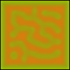
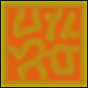

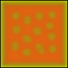
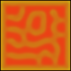
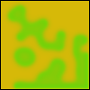
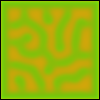

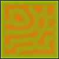
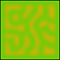

#### Plants
Plants represent food sources for preys. They're build using L-Systems. Based on [The Algorithmic Beauty of Plants Book](http://algorithmicbotany.org/papers/abop/abop.pdf)

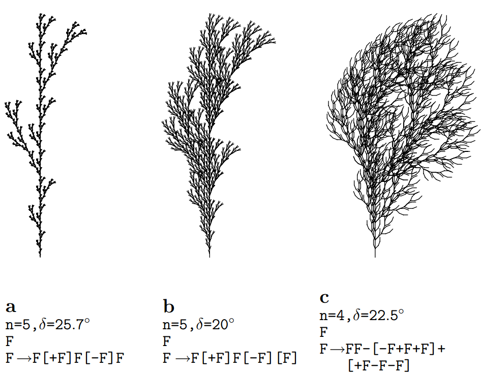
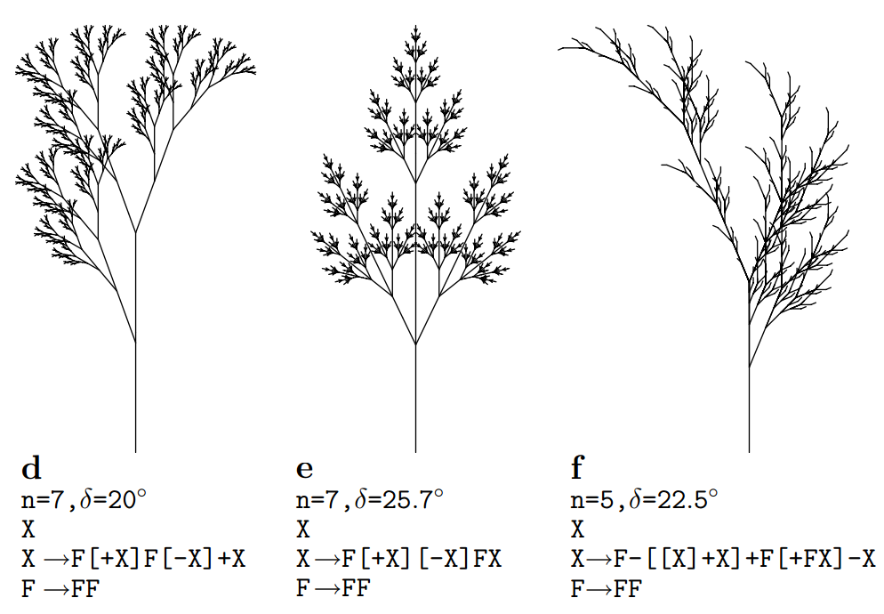
### Seasons
Food sources have several states which represent seasons (different growing stages depending on location). This feature lets us see interesting emergent behavior as migrations.

### Evolution

Evolution is achieved through the use of a genetic algorithm. Regularly a iteration is performed and the entire population is replaced using selection, reproduction, crossover and mutation principles.
 - Selection: Some individuals are chosen depending on features such as: speed, metabolism rate and vision range. A tournament is performed and pairs of individuals are picked to reproduce.
 - Crossover: Each pair of parent individuals give born a pair of children, which features (speed, metabolism, vision) are set based on their parents' values
 - Mutation: The features of each new individual are modified, those values can be increased or decreased based on certain probability.

## Prerequisites
Java and [Processing](https://processing.org/) are required to run this program.

The structure of the project is made for running it on an IDE such as *IntelliJ IDEA* or *eclipse*.

The instructions to use [Processing](https://processing.org/) library on Eclipse  can be found [here](https://processing.org/tutorials/eclipse/)

## Demo
A video which shows the simulation working can be found [here](https://youtu.be/r3rPx0F-xAM)
